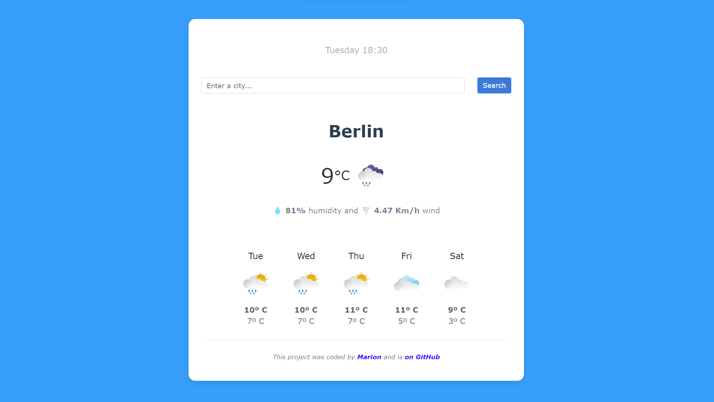

# 🌦️ Weather App

## 📝 Project Overview 
This application allows you to easily check the weather forecast for any location by simply typing in the city name.

## 🎨 Features
- **Current Weather:** Get the latest weather conditions including temperature, humidity, and wind speed.
- **Forecast:** View a detailed forecast for the upcoming days.
- **Location-based:** Allows you to search for weather information in any city worldwide.

## 🚀 Usage
1. Enter the name of the city you want to check the weather for in the search bar.
2. Click on the "Search" button or press Enter to fetch the weather information.
3. Explore the current weather conditions and the forecast for the upcoming days.

## 💻 Technologies Used
- 
- 
- 
-  - Provides weather data and emojis
-  - Web Hosting

## 📷 Screenshot View

## 🤝 Contributing
Contributions are welcome! 
If you'd like to contribute, open an issue or submit a pull request.
